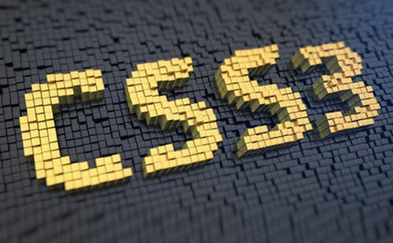

# CSS预处理，总有一款适合你

相信前端开发人员对于CSS（Cascading Style Sheet-级联样式表）这种“面向命名语言”，一定非常熟悉。你可能在某个舍友熟睡的深夜，还在电脑面前被 css 繁重、冗杂的样式，折磨的死去活来。

我们曾经面对 css 很多令人发指的不友好特性，也因为 css 的低复用性而刀耕火种。

为了摆脱这样的苦恼，CSS预处理器因此而诞生。

## 概念

CSS 预处理器用一种专门的编程语言，进行 Web 页面样式设计，然后再编译成正常的 CSS 文件，以供项目使用。**CSS 预处理器为 CSS 增加一些编程的特性，无需考虑浏览器的兼容性问题。**

## 理由

1. CSS语法不够强大，比如无法嵌套书写导致模块化开发中需要书写很多重复的选择器；
2. 没有变量和合理的样式复用机制，使得逻辑上相关的属性值必须以字面量的形式重复输出，导致难以维护等

看到这里很多小伙伴就要问了，到底有哪些主流的预处理器呢？

> Sass：2007年诞生，最早也是最成熟的CSS预处理器，拥有ruby社区的支持和compass这一最强大的css框架，目前受LESS影响，已经进化到了全面兼容CSS的SCSS。
> Less：2009年出现，受SASS的影响较大，在ruby社区之外支持者远超过SASS，其缺点是比起SASS来，可编程功能不够，不过优点是简单和兼容CSS。著名的Twitter Bootstrap就是采用LESS做底层语言的。
> Stylus：2010年产生，来自Node.js社区，主要用来给Node项目进行CSS预处理支持，在此社区之内有一定支持者，在广泛的意义上人气还完全不如SASS和LESS。

那这些预处理器有哪些相似之处呢？

## 相同点

可以在 CSS 中使用变量、简单的程序逻辑、函数等等在编程语言中的一些基本技巧，可以让你的 CSS 更见简洁，适应性更强，代码更直观等。

## 不同点

**1. 变量：**

* Sass声明变量必须是“$”开头，后面紧跟变量名和变量值，而且变量名和变量值需要使用冒号：分隔开。
* Less 声明变量用“Sass声明变量必须是“$”开头，后面紧跟变量名和变量值，而且变量名和变量值需要使用冒号：分隔开。
* Less 声明变量用“@”法和Less、Sass完全相同。

**2. 作用域：**

css 预编译器把变量赋予作用域，也就是存在生命周期。就像 js 一样，它会先从局部作用域查找变量，依次向上级作用域查找。

* Sass：三者最差，不存在全局变量的概念。
* Less：我认为跟 JS 一样，逐级查找，向上冒泡。
* Stylus：完全等同 Less。Stylus 和 Sass 则更倾向于指令式。

**3. 嵌套：**

十分真诚的说，三种 css 预编译器的选择器嵌套在使用上来说没有任何区别（也可能是我没发现）。Sass 除了常规的采用“&”替代父级选择器之外，还提供了奇葩的属性嵌套：

``` css
/*style.sass*/
.footer {
    font: {
        family: 微软雅黑;
        size: 5rem;
        weight: bolder;
    }
}
```

**4. 继承：**

css 属性的继承是一个非常重要的特性，好消息是三种预编译器都对此做出了改善。

* Sass和Stylus的继承非常像，能把一个选择器的所有样式继承到另一个选择器上。使用“@extend”开始，后面接被继承的选择器。

``` css
.shit {
    margin: 10px 5px;
    padding: 2px;
}

p {
    @extend .shit;
    /*继承.block*/
    border: 1px solid #aaa;
}

ul,
li {
    @extend .shit;
    /*继承.block*/
    color: #aaa;
}
```

将被编译成标准 css：

``` css
.shit,
p,
ul,
ol {
    margin: 10px 5px;
    padding: 2px;
}

p {
    border: 1px solid #aaa;
}

ul,
li {
    color: #aaa;
}
```

* Less 继承：与前两者继承方式有所区别，它不是在选择器上继承，而是将Mixins中的样式嵌套到每个选择器里面。然而这样会带来一个明显的缺点：每个选择器中会出现重复的样式。

**5. 导入@Import：**

CSS中，不建议用@import导入css，因为会增加http请求。但 CSS 预处理器中的导入和CSS的有hhe很大区别，它是将不同 css 是在语义上导入，最终编译结果会生成一个CSS文件。

值得注意的是，如果不同文件相互引入的时候，出现相同变量名时可能会引起错误。所以我的建议是单独有一个 var.sass/less/styl 文件来记录所有你定义的变量。

Less 为@Import 扩展了语法，而 Sass 和 Stylus 并没有。

## 使用

目前各大前端框架都已支持当下主流的预编译器，只需要根据文档添加配置即可；此外也可以利用webpack去配置使用。

## 总结

css预处理，通过变量/运算/函数，解决代码冗余，使用extend、Mixin，实现代码片段复用。
