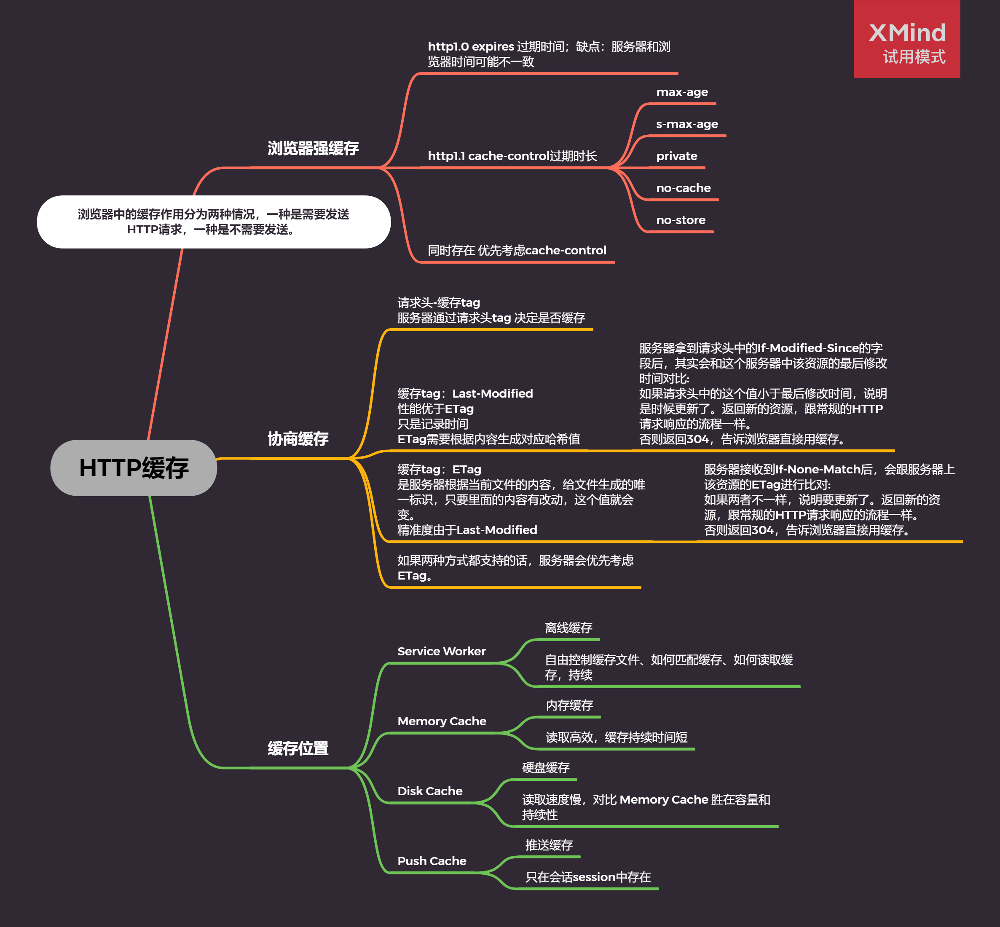

# 浏览器缓存

## 缓存位置

1. Service Worker

Service Worker 是**运行在浏览器背后的独立线程**，一般可以用来实现缓存功能。
注意点：必须是 HTTPS。因为它涉及请求拦截，所以必须使用 HTTPS 协议来保障安全。
Service Worker 缓存不同于其他机制，它可以让我们自由控制缓存哪些文件、如何匹配缓存、如何读取缓存，并且缓存是持续性的。

2. Memory Cache

内存中的缓存，主要是页面上已经下载的样式、脚本、图片等已经抓取到的资源。
注意点：
读取内存中的数据肯定比磁盘快，**读取高效**。
**缓存持续性很短**，会随着进程的释放而释放。关闭页面内存中的缓存也就释放了。

3. Disk Cache

是存储在硬盘中的缓存，**读取速度相对慢点**。

注意点：
比起 Memory Cache 胜在**容量**和**存储时效性**上。

4. Push Cache

（推送缓存） 是 HTTP/2 中的内容，当以上 3 种缓存都没有命中的时候，它才会被使用。
注意点：
它只在会话（Session）中存在，一旦会话结束就被释放，并且缓存也很短暂。

## 缓存机制

缓存分为 **强缓存** 和 **协商缓存**
浏览器中的缓存作用分为两种情况，一种是需要发送HTTP请求（协商缓存），一种是不需要发送（强缓存）。

若强制缓存生效则直接使用缓存，若不生效则进行协商缓存。
协商缓存由服务器决定是否使用缓存，若协商缓存失效，那么该请求的缓存失效，返回 200，重新返回资源和缓存标识，再存入浏览器中；
如果强缓存和协商缓存都没有设置，那么浏览器会采用启发式的算法，通常会取响应头中的 Date 减去 Last-Modified 的值的 10% 作为缓存时间。

1. 强缓存

Expires 是 HTTP/1.0 的产物 （服务器的时间和浏览器的时间可能并不一致，导致准确性不确定）
Cache-Control 是 HTTP/1.1 的产物

**max-age**：过期时长控制缓存。
**public**: 客户端和代理服务器都可以缓存。因为一个请求可能要经过不同的代理服务器最后才到达目标服务器，那么结果就是不仅仅浏览器可以缓存数据，中间的任何代理节点都可以进行缓存。
**private**： 这种情况就是只有浏览器能缓存了，中间的代理服务器不能缓存。
**no-cache**: 跳过当前的强缓存，发送HTTP请求，即直接进入协商缓存阶段。
**no-store**：非常粗暴，不进行任何形式的缓存。
**s-maxage**：这和max-age长得比较像，但是区别在于s-maxage是针对代理服务器的缓存时间。
**must-revalidate**: 是缓存就会有过期的时候，加上这个字段一旦缓存过期，就必须回到源服务器验证。

两者同时存在的时候，Cache-Control 优先级高于 Expires。

2. 协商缓存

强缓存失效之后，浏览器在请求头中携带相应的缓存tag（缓存标识）来向服务器发请求，由服务器根据这个tag，来决定是否使用缓存，这就是协商缓存。

### 缓存tag分为两种: Last-Modified 和 ETag。

**Last-Modified**: 最后修改时间
服务器拿到请求头中的**If-Modified-Since**的字段后，其实会和这个服务器中该资源的最后修改时间对比:
如果请求头中的这个值小于最后修改时间，说明是时候更新了。返回新的资源，跟常规的HTTP请求响应的流程一样。
否则返回304，告诉浏览器直接用缓存。

**ETag**: 根据文件的具体内容生成哈希值
服务器接收到**If-None-Match**后，会跟服务器上该资源的ETag进行比对:
如果两者不一样，说明要更新了。返回新的资源，跟常规的HTTP请求响应的流程一样。
否则返回304，告诉浏览器直接用缓存。

两者对比：
精准度：ETag优于Last-Modified
性能: Last-Modified优于ETag

# 总结

对浏览器的缓存机制来做个简要的总结:
首先通过 Cache-Control 验证强缓存是否可用
 + 如果强缓存可用，直接使用
 + 否则进入协商缓存，即发送 HTTP 请求，服务器通过请求头中的If-Modified-Since或者If-None-Match这些条件请求字段检查资源是否更新
   + 若资源更新，返回资源和200状态码
   + 否则，返回304，告诉浏览器直接从缓存获取资源

